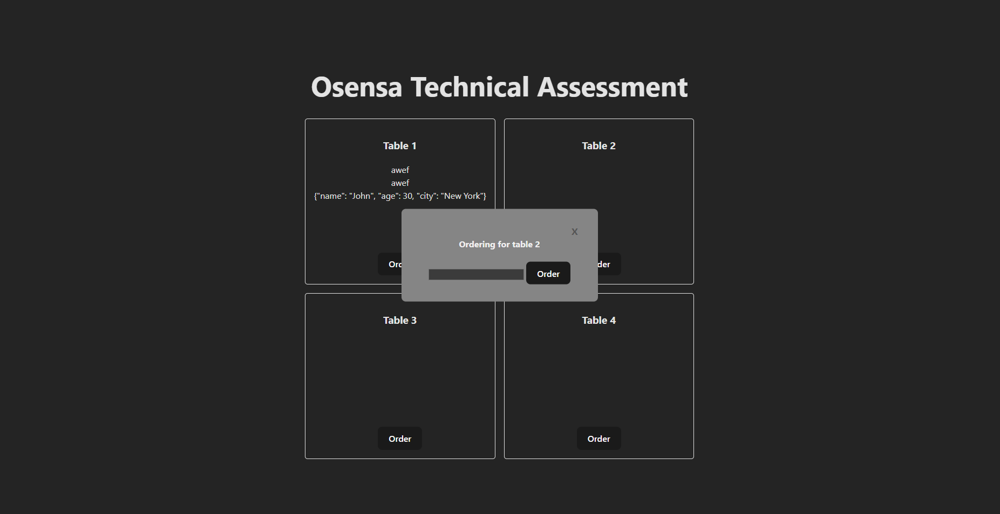
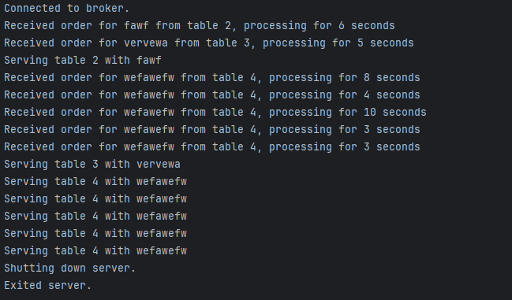
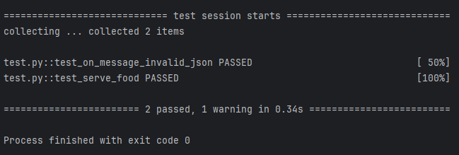

# Osensa Technical Assessment
## Setup
This project consists of a frontend inside of the folder "webapp" and a backend inside of the folder "backend".

To run the project, the following requirements must be met:
1. A MQTT broker. The server must allow WebSocket connections over PORT 9001 and IPV4 connections over port 1883. Additionally, the code assumes that the MQTT broker is running on localhost. The code has only been tested using a mosquitto MQTT broker, but should work with other MQTT brokers.
2. All dependencies in backend and frontend installed. Frontend dependencies are automatically tracked by the project setup while backend dependencies are stored inside of requirements.txt.

## Client Demo
The webapp automatically filters out trailing and leading whitespaces, additionally, edge cases such as passing in a JSON string as a food order has been tested for.

## Server Demo
The server automatically features verbose output on each order and its wait time. Additionally, it is capable of disconnecting cleanly and outputting when it connects and disconnects.

## Tests
The program features backend server tests that ensures correct responses and robust functionality.
